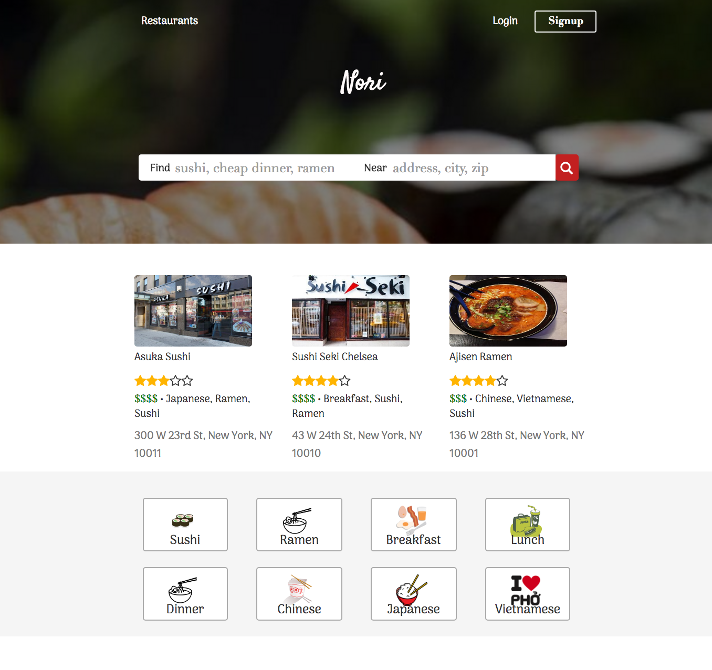
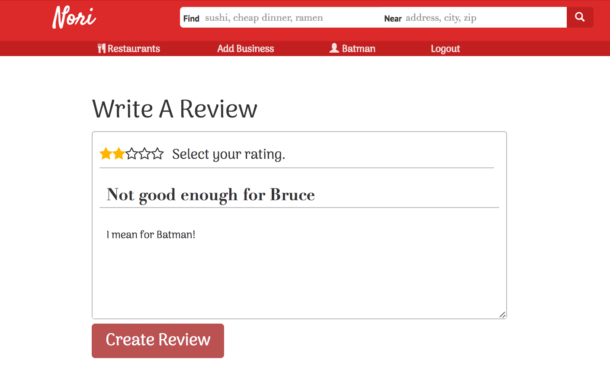

# Nori

[Demo Nori -- hosted on Heroku](https://sushi-nori.herokuapp.com/)

Have you ever wanted to get sushi or ramen but were new to town, wanted to try some place new, or want to try the best in town?  Now you can with Nori.  Nori lets you search sushi, ramen, and various asian inspired businesses.   Nori aims to allow searching of businesses by name, rating, price, and category.

Nori is a single-page web application inspired by Yelp. Nori's JSON backend is using Ruby on Rails (version 4.2.8) and a postgresql database.  We are using a frontend of React.js with a Redux architectural framework on the front-end.

## Features
* Account creation and authentication
* Search for businesses by name and category
	* Displays listings with rating, price, address	 
* Google Maps integration to view locations
	* Custom flag icon
	* Hover over flag on map to see info window
	* Hover over a business to find on map
* View a business's page
    * Displays business details (address, telephone number, average rating)
    * Displays all reviews for the business
    * Has option to create or edit reviews and upload a new profile picture for the business
* Create, read, and delete reviews/ratings for a business
	* User can only create one review for a business
    * Users may only delete reviews that they personally wrote
* Users can upload images for a business
	* Images belong to a user and a business

## Implementation
### User Authentication
User authentication consists of hand rolled authentication on the rails backend. Passwords are hashed using BCrypt, and the resulting hash is stored in the database (passwords are never saved to the database). When a user logs in, their password is rehashed on the backend and compared to the encrypted version in the database.  If the credentials are correct, a their session token is regenerated and the session cookie changes. A session cookie is stored on the user's browser, in the updated in the database, and in the rails session store.

The frontend extends this authentication by using protected and authenticated routes.  The backend on initial (non-ajax) requests boot straps a user object on the window with an id and username.  Subsequent (ajax) requests to the backend will send back a null current user if the session doesn't exist.

### Splash Page
The splash page has a search bar that will performs just like the search bar component in the navigation bar on the rest of the site.  The page also displays three of the featured businesses and all of the categories.

### Search
Nori searches for businesses by sending ajax requests with query strings for `name`, `address`, `price_rating` & `category`.  The backend is using PgSearch to search text of businesses and associated models like categories.

### Map
When searching for a business, the response updates the businesses slice of state with all matching businesses.  A map view component is rendered that uses a business marker class to manage the addition and removal of markers.  Location markers are placed on the map for each business search listing.  During that time, event listeners are registered for click, mouseover, and mouseleave events on the google map.  Markers are updated on state change to remove and add the necessary business markers.

### Business page
All businesses are stored in one table in the database, which contains columns for `id`, `name`,  a formatted `address` from the Google Reverse Geocoding API, `phone_number`, geographic location (`lat` and `lng`), the `hours` of operation and a business profile image(`business_image`). The `business_image` is changed into two different sizes, medium and thumbnail which is uploaded to Amazon Web Services S3 using the Paperclip gem.

### Reviews/Ratings
Every review made by a user contains the following information stored in the database: `id`, `rating`, `title`, `description`, `user_id`, and `business_id`.

Every time a user creates or updates a review, the business's overall rating is recalculated and updated. Nori uses react-star-component for its dynamic stars rating feature.

## Plans for the Project

### Smarter Query Search Results -- COMPLETED
I want to make the search functionality a lot better.  Right now users cannot go back to their previous search results without typing them in again.  I want to make the query change the path so the state can be replicated on refresh/external linking.  I am going to look into using the PGsearch gem, or adding the queries params myself.

### Profiles/Feed
I want to add profiles so users can view the images they have contributed to the local businesses.  It would be nice if they could see how many businesses they have reviewed and the distribution spread of the ratings they give.

### Image Gallery
I want to create a custom carousel and modal image viewer.  This would be for the business show pages.  There would also be a image viewer for the profiles of users.

### Visits/Check-Ins
I want users to be able to check so they can document all of their trips to the business and their experiences.
